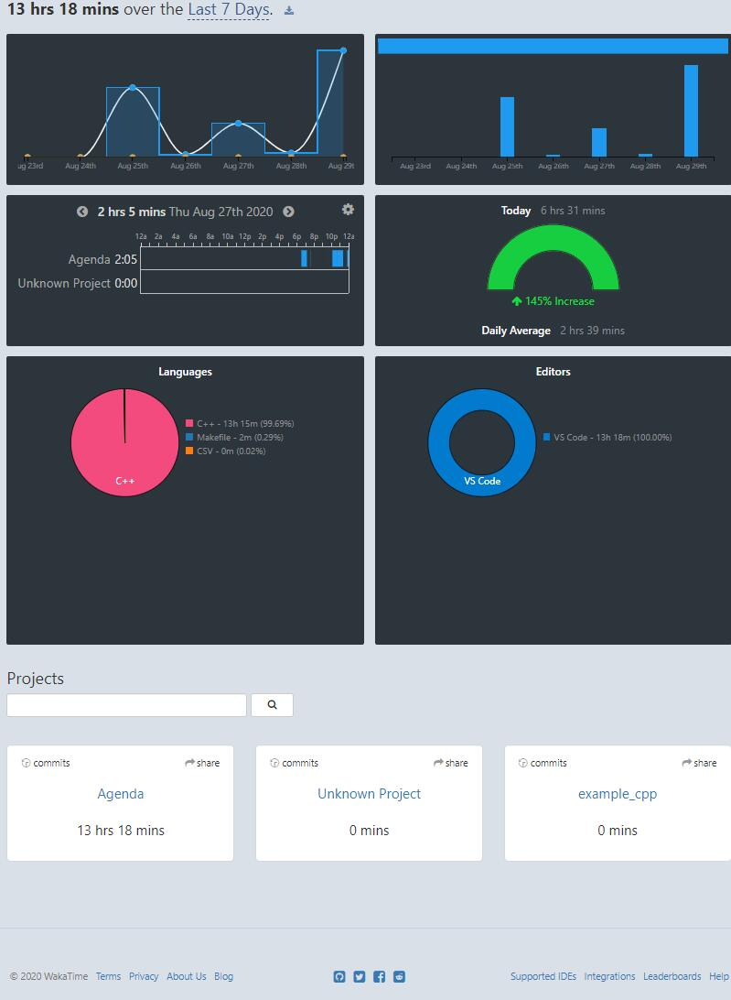

# 中山大学 2019 年初级实训 Agenda 项目

请根据 https://wiki.vmatrix.org.cn 上的需求完成 Agenda 项目，编写可以编译 Agenda 以及 Google Test 的 Makefile，并使用 git 提交至 https://git.vmatrix.org.cn 上自己的仓库中。

**注意：请将代码提交至自己的仓库中，否则评测系统不会自动评测。同时需要注意在评测时间前确保 master 分支中为正确的代码。**

2020-8-29/20:40 通过全部测试
总耗时13.25h
